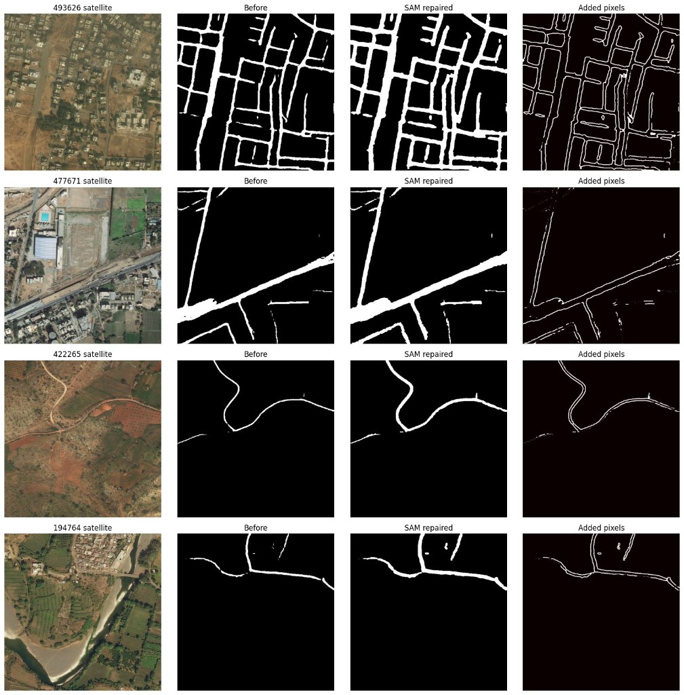

# Results screenshots

Training curves and Colab run outputs from Route Resilience experiments.

| File | Description |
|------|-------------|
| `phase1_training_curves.png` | Phase I loss + IoU curves (30 epochs) |
| `phase2_graph_healing.jpeg` | Phase II graph / skeleton visualization |
| `phase2_or_phase3_run.jpeg` | Phase II/III Colab run output |
| `phase3_criticality_*.jpeg` | Phase III gatekeeper heatmaps per tile |
| `phase4_dashboard_screenshot.png` | Phase IV React dashboard |
| `phase1_sam_mask_repair_comparison.png` | Phase I SAM mask repair — before/after on 4 demo tiles |

Tile IDs: 194764, 422265, 477671, 493626.

## SAM mask repair (Phase I post-processing)

DeepLab masks repaired with SAM (`phase1_sam_mask_repair.ipynb`) — no retraining.

| Tile | Components before → after | Largest-component fraction |
|------|---------------------------|----------------------------|
| 493626 | 13 → 9 | 0.946 → 0.934 |
| 477671 | 16 → 10 | 0.844 → 0.832 |
| 422265 | 5 → 3 | 0.539 → 0.936 |
| 194764 | 13 → 5 | 0.619 → 0.860 |

Output masks: `outputs/masks_sam_repaired/` on Drive.
