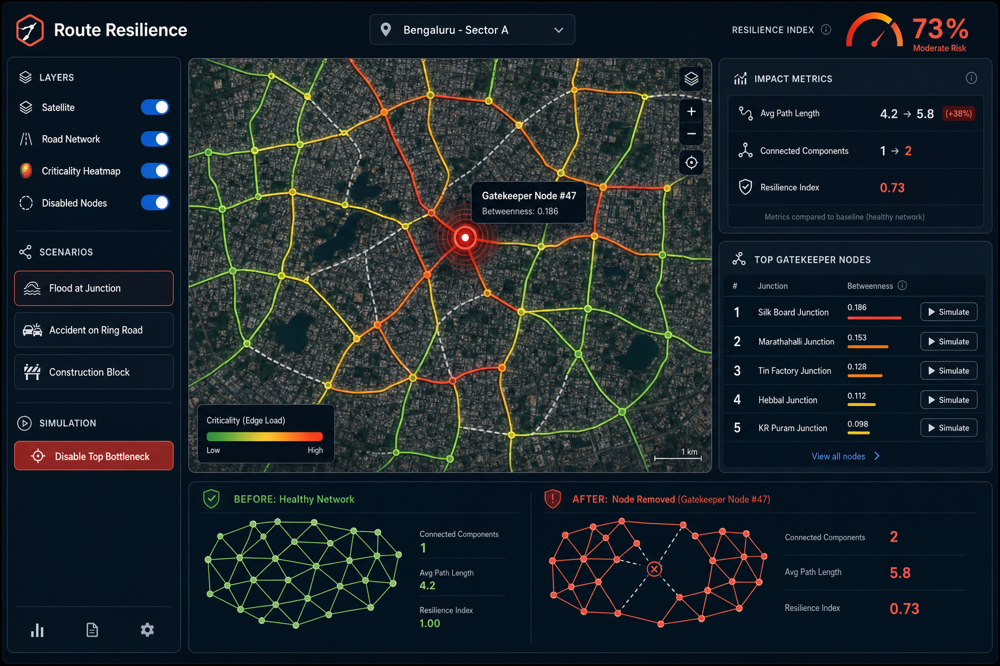
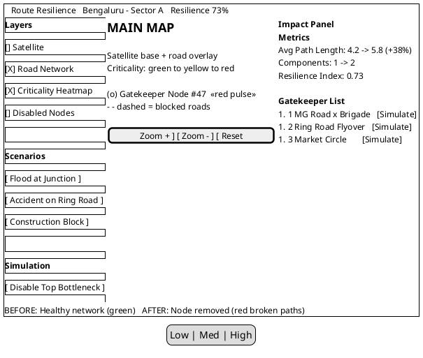

# Route Resilience — React Dashboard Wireframe (Starting Mockup)

**Dark command-center UI** for Phase IV. This is the layout we agreed on before wiring real Phase III JSON.

---

## Visual mockup (PNG)



**File path:** `docs/assets/route-resilience-dashboard-mockup.png`

Paste this PNG into your ISRO PPT **Wireframes / Demo** slide.

---

## ASCII wireframe (1440 x 900 desktop)

```
┌──────────────────────────────────────────────────────────────────────────────┐
│  HEADER  (64px)                                                              │
│  [Logo] Route Resilience     [📍 Bengaluru ▾]              [Resilience 73%]  │
├──────────────┬───────────────────────────────────────────┬───────────────────┤
│              │                                           │                   │
│  SIDEBAR     │              MAIN MAP                     │   IMPACT PANEL    │
│  (280px)     │              (flex-grow)                  │   (340px)         │
│              │                                           │                   │
│  Layers      │   ┌─────────────────────────────────┐   │  Metrics Card     │
│  ○ Satellite │   │                                 │   │  ─────────────    │
│  ● Roads     │   │   Satellite + road overlay      │   │  Avg Path Length  │
│  ● Heatmap   │   │   Green → Red criticality       │   │  4.2 → 5.8 (+38%) │
│  ○ Disabled  │   │                                 │   │                   │
│              │   │      🔴 Gatekeeper Node #47     │   │  Components       │
│  Scenarios   │   │                                 │   │  1 → 2            │
│  [Flood]     │   │   ─ ─ dashed = blocked roads    │   │                   │
│  [Accident]  │   │                                 │   │  Resilience Index │
│  [Construct] │   └─────────────────────────────────┘   │  0.73             │
│              │                                           │                   │
│  [Disable    │   Map controls: zoom, reset, legend      │  Gatekeeper List  │
│   Top Node]  │                                           │  #1 MG × Brigade  │
│              │                                           │  #2 Ring Flyover  │
│              │                                           │  #3 Market Circle │
├──────────────┴───────────────────────────────────────────┴───────────────────┤
│  BOTTOM COMPARISON BAR  (200px)                                              │
│  BEFORE: Healthy Network          │        AFTER: Node Removed               │
│  [green connected graph mini]     │        [red broken graph mini]           │
└──────────────────────────────────────────────────────────────────────────────┘
```

---

## PlantUML Salt wireframe (paste into plantuml.com)



---

## React component tree

```
src/
├── App.jsx
├── layout/
│   ├── Header.jsx              ← logo, city selector, resilience gauge
│   ├── Sidebar.jsx             ← layers + scenario buttons
│   ├── ImpactPanel.jsx         ← metrics + gatekeeper list
│   └── BottomComparison.jsx    ← before/after mini graphs
├── map/
│   └── MapView.jsx             ← Leaflet wrapper + layers
├── components/
│   ├── MetricCard.jsx
│   ├── GatekeeperRow.jsx
│   └── LayerToggle.jsx
├── data/
│   └── loadAnalysis.js         ← loads criticality.json (was mockGraph.js)
└── theme/
    └── tokens.js               ← colors, criticalityColor()
```

---

## Design tokens (`src/theme/tokens.js`)

| Token | Value | Use |
|-------|-------|-----|
| bgPrimary | `#0f1419` | Page background |
| bgCard | `#1a2332` | Panels, cards |
| bgHover | `#243044` | Button hover |
| border | `#2d3f56` | Card borders |
| textPrimary | `#e8eaed` | Headings |
| textMuted | `#8b9cb3` | Labels |
| danger | `#e74c3c` | Critical nodes |
| warning | `#f39c12` | Medium criticality |
| safe | `#2ecc71` | Healthy roads |
| info | `#3498db` | Selected, links |

**Road criticality gradient:** safe (green) → warning (orange) → danger (red)

---

## Panel breakdown

| Panel | Contents |
|-------|----------|
| **Header** | Logo, sample/tile dropdown, resilience gauge ring |
| **Sidebar (280px)** | Layer toggles, 3 scenario buttons, red "Disable Top Bottleneck" CTA |
| **Main map (~60%)** | Satellite JPG overlay, colored road polylines, gatekeeper markers, dashed disabled edges |
| **Impact panel (340px)** | 3 metric cards, scrollable gatekeeper list with Simulate buttons |
| **Bottom bar (200px)** | Before vs After network comparison |

---

## Run the built UI

```bash
cd ~/Projects/route-resilience-ui
npm install
npm run dev
```

Copy `493626_criticality.json` into `public/data/` to see real Phase III data on this layout.
